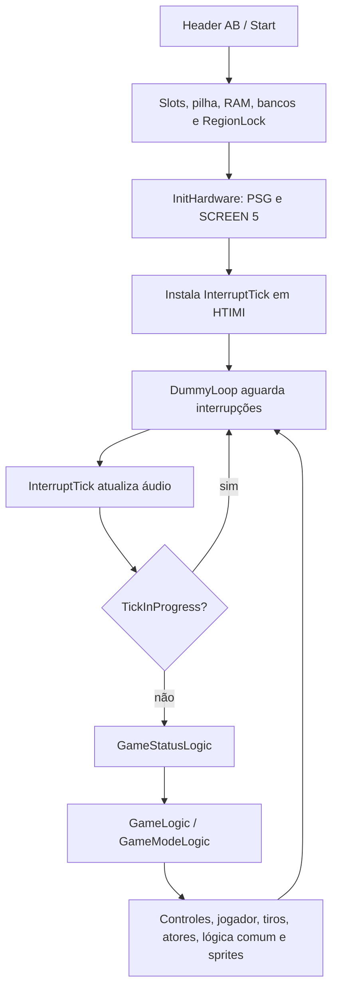

# Arquitetura geral

Escopo e graus E/B/H/P: [índice](README.md). Todos os comportamentos nesta página são **E**, salvo ressalva explícita.

## Fluxo principal

| Descoberta | Fonte / símbolo | Evidência |
| --- | --- | --- |
| Programa Z80, endereços de 16 bits e acesso ao BIOS MSX | Banks0123.asm:552 `Start`; constants/bios.asm | DI/EI, IX/IY, LDIR, EXX, IN/OUT e chamadas ENASLT/RSLREG/CHGMOD. Não há emulação de CPU no Godot. |
| Entrada de cartucho | Banks0123.asm:8; `Start` | ORG 0x4000, assinatura AB, palavra de entrada. Nas duas ROMs, palavra de entrada aponta para 0x41F3 (B apenas para o header). |
| RAM e slots | Banks0123.asm:552 `Start` | SP recebe Stack; descobre slot e habilita cartucho em 0x8000–0xBFFF; zera 0xC000–0xF0EF; configura bancos e chama RegionLock. |
| Loop orientado por interrupção | Banks0123.asm:440 `InterruptTick`, :607 `DummyLoop` | Start grava JP no hook HTIMI, definido como 0xFD9F em constants/SystemVariables.asm:16; laço externo apenas salta para si. |
| Áudio precede lógica | Banks0123.asm:440 | Seleciona bancos 4/5, chama UpdateSound e restaura bancos antes de testar TickInProgress. EI permite novas interrupções; flag evita reentrância da lógica, não impede atualização de som. |
| Estados superiores | Banks0123.asm:10058 `GameStatusLogic` | TickCounter incrementado; JumpIndex despacha nove estados: logo, espera/menu, demo, início, criação do jogo, gameplay, game-over, pausa/save/load e final. |
| Submodos de gameplay | Banks0123.asm:12015 `GameLogic`, `GameModeLogic` | Atualiza apresentação conforme modo, lê controles, despacha Playing/NextRoom/menus/rádio/caminhão/elevador/porta/binóculos/morte/texto/captura/evento. |
| Ordem da simulação | Banks0123.asm:12151 `PlayModeLogic`; logic/common.asm:8 `CommonLogic` | Alerta, temporizadores e chamada recebida; jogador; disparo; tiros; inimigos; colisões de combate, ambiente, portas e itens; veneno e atualização de sprites. Alguns estados pulam passos. |

A ordem importa para fidelidade: o fluxo não é simplesmente “mover todos e depois desenhar”. A lógica pode mudar modo durante a iteração. O remake deverá modelar passos discretos antes de interpolar apresentação. **P:** ordem exata de todos os submodos. Não se converte ainda velocidade para pixels/segundo.

## Tick e cadência real

**E (asm):** uma iteração de jogo por interrupção do VDP (`InterruptTick`, Banks0123.asm:440-471,
instalada em `HTIMI` em 599-601); se `TickInProgress` (0xC005) indica iteração anterior em curso, a
interrupção só atualiza o som. Não há `halt` nem espera explícita: a cadência depende do tempo de CPU.
`TickCounter` (0xC003) só é incrementado por `GameStatusLogic` (Banks0123.asm:10058-10060); as demais
referências (`Banks0123.asm:6572`, `tankshell.asm`, `scorpion.asm`, `dog.asm`) só o leem como semente.
A edição inglesa não grava o registrador 9 do VDP nem consulta `BASVER` (`RegionLock` vazio fora do ramo
japonês, `logic/regionlock.asm`; `InitVdpDat` só grava R#1, R#5, R#6 e R#11): a frequência é a da máquina.

**E (openMSX 21, `C-BIOS_MSX2_EU`, ROM canônica, sem teclas, `tools/emulation/tick_rate.tcl`, 120 s
emulados após 2 s):** R#9 = 82h (PAL); 6016 interrupções = 50,1 Hz. Iterações por interrupção:

| GameStatus.GameMode | Interrupções | Iterações | Intervalo dominante |
| --- | --- | --- | --- |
| 0.0 logo | 1482 | 1144 | 1 (1098×); cargas de 13–158 |
| 1.0 menu | 768 | 768 | 1 |
| 2.0 demo jogando | 2645 | 1077 | **2** (1026×; 1 em 41×, 3 em 2×) |
| 2.10 demo, janela de texto | 1112 | 1105 | 1 (1098×) |

**H:** a cadência 2 em jogo vem de iterações que excedem um quadro; salas com mais atores podem chegar a
3, e o BIOS real (mais pesado que o C-BIOS) pode alterar a margem. Rádio, menus, binóculos e captura não
foram medidos.

**Port (decisão do projeto, 2026-10-06):** mesma estratégia com interrupção de 60 Hz em `GameClock`
(`godot/scripts/systems/game_clock.gd`): `_physics_process` do sandbox é a interrupção e `game_tick()` a
iteração; jogo a cada 2 interrupções (30 it/s), janela de texto a cada 1; modos não medidos a cada 1.
A máquina europeia real roda a 50 Hz (25 it/s em jogo).

### Ordem de `PlayModeLogic` versus `game_tick`

ROM (Banks0123.asm:12151-12208; logic/common.asm:8-47): `ChkAlarmEnd` → `DamageDelayTimer` →
`ChkIncomingCall` → `DecNukeTimer` → (morto: só sprites) → `PlayerControlLogic` (exceto Metal Gear
explodindo) → `ChkWeaponShot` → `PlayerShotsLogic` → `EnemiesLogic` → `CommonLogic` (`ChkPlayerShots`,
`ChkTouchEnemies`, `ChkOnBridge`, `ChkElectricFloor`, `ChkGasRooms`, `ChkDoors`, `ChkTakeItems`, captura)
→ veneno a cada 64 ticks. Antes disso, `GameLogic` (12015-12089) desenha HUD/sprites e lê controles.
`game_tick` segue jogador → atores/colisões por sistema; a reordenação fina por rotina fica para as
issues de cada sistema.

## Hardware gráfico e áudio

`logic/inithardware.asm:14 InitHardware` chama CHGMOD com 5 (SCREEN 5), inicializa PSG, limpa páginas de VRAM e grava registradores VDP. `InitVdpDat` configura sprites e tabelas, com comentários de atributos 0xF600 e padrões 0xF800. `Banks0123.asm` contém operações VDP_Copy_Dot, DrawTile, transferências RAM/VRAM e buffers; `logic/updatesprites.asm` trata atualização e alternância/embaralhamento de sprites. Fontes de portas usam cópias retangulares na VRAM, não um TileMap de hardware que deva ser reproduzido literalmente no Godot.

Tiles lógicos de 8×8 são desenhados como bitmap. `UnpackGfx` (Banks0123.asm:3684) decodifica blocos literais/repetidos para VRAM; Load1bppTiles/Load2bppTiles/Load3bppTiles têm rotas próprias. Não supor um único formato de compressão para todos os recursos.

`sound/sound.asm` inclui bgmdriver.asm, instruments.asm, setsound.asm e sounddata.asm. `sound/bgmdriver.asm:12 UpdateSound` processa quatro áreas de trabalho de 0x20 bytes (três musicais e uma de SFX); Variables.asm:32 em diante declara essas áreas. O driver atualiza PSG, envelope, volume, instrumentos e transições musicais. **P:** especificação completa dos comandos musicais, correspondência sonora e exportação de áudio.

`logic/controls.asm:8 UpdateControls` combina teclado e joystick via SNSMAT/WRTPSG/RDPSG, mantém held/trigger. Ver [movimentação](movement-and-collision.md). Não atribuímos desempenho de hardware ou áudio equivalentes a uma inspeção estática.
